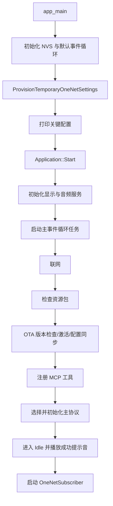

# 项目工作原理说明

> 本文档基于当前仓库代码整理，说明这个 ESP32 项目从上电启动、联网、语音交互，到 MCP 工具调用和 OneNET 传感器集成的整体工作方式。
>
> 如果你第一次接手这个项目，建议先读本文，再结合以下协议文档继续深入：
>
> - [`mqtt-udp.md`](./mqtt-udp.md)
> - [`websocket.md`](./websocket.md)
> - [`mcp-protocol.md`](./mcp-protocol.md)
> - [`mcp-usage.md`](./mcp-usage.md)

---

## 1. 项目定位

这个项目本质上是一个运行在 ESP32 上的语音 AI 终端。它把硬件能力、音频能力、网络协议和 MCP 工具系统组合在一起，让设备具备以下能力：

- 采集麦克风音频、播放扬声器音频
- 做离线唤醒词检测、VAD 检测、音频预处理
- 通过 **MQTT+UDP** 或 **WebSocket** 与云端服务交互
- 把设备能力暴露成 **MCP 工具**，供大模型调用
- 通过 OTA 获取服务器配置、时间、激活信息和新固件
- 在当前分支中，还支持从 **OneNET** 拉取外部传感器数据，并缓存到设备侧供 AI 查询

可以把它理解成：

**ESP32 硬件平台 + 实时语音链路 + 云端协议 + MCP 工具系统 + 外部物联网数据接入**。

---

## 2. 整体架构分层

| 层级 | 主要文件/目录 | 作用 |
| --- | --- | --- |
| 启动入口层 | `main/main.cc` | 初始化 NVS、事件循环、临时配置，最后启动应用 |
| 硬件抽象层 | `main/boards/` | 封装不同开发板的音频、显示、LED、网络、按键等差异 |
| 应用协调层 | `main/application.h/.cc` | 管理设备状态、主事件循环、协议回调、联网后主流程 |
| 音频服务层 | `main/audio/` | 麦克风采集、扬声器播放、唤醒词、VAD、Opus 编解码 |
| 协议层 | `main/protocols/` | 实现 WebSocket 或 MQTT+UDP 与服务器通信 |
| OTA 与配置层 | `main/ota.cc`、`main/settings.*` | 版本检查、固件升级、远端配置同步、NVS 持久化 |
| MCP 层 | `main/mcp_server.cc` | 设备能力注册成工具，并处理 JSON-RPC 调用 |
| 传感器集成层 | `main/boards/common/onenet_subscriber.*`、`device_control_mcp_tool.*` | 拉取 OneNET 数据、缓存传感器状态、对 AI 暴露查询工具 |

---

## 3. 启动流程

### 3.1 启动时序概览



### 3.2 详细步骤

#### 1. `app_main` 负责系统初始化

启动入口在 `main/main.cc`，主要做几件事：

- 初始化默认事件循环
- 初始化 NVS
- 在当前分支里，通过 `ProvisionTemporaryOneNetSettings()` 为 `onenet` 命名空间写入一组临时默认配置（如果尚未配置）
- 打印当前 OneNET 集成配置，方便串口排查
- 调用 `Application::GetInstance().Start()` 进入应用层

#### 2. `Application::Start()` 启动设备主体逻辑

`Application::Start()` 是整个项目真正的运行入口，负责串起后续所有模块：

- 设置设备初始状态为 `Starting`
- 初始化显示并显示设备信息
- 初始化音频服务 `AudioService`
- 注册音频回调
- 创建主事件循环任务 `MainEventLoop`
- 启动时钟定时器更新状态栏
- 等待网络准备完成
- 检查资源包更新
- 执行 OTA 检查、激活、时间同步等逻辑
- 注册 MCP 工具
- 根据配置决定使用 `MqttProtocol` 或 `WebsocketProtocol`
- 启动主协议
- 进入 `Idle` 状态并播放成功提示音
- 启动 `OneNetSubscriber`，让外部传感器数据接入工作起来

#### 3. 网络准备失败时会进入配网模式

以 Wi-Fi 板卡为例，`main/boards/common/wifi_board.cc` 中的 `StartNetwork()` 会：

- 先读取已保存的 SSID/密码
- 如果没有 Wi-Fi 配置，就进入配网模式
- 如果有配置，则扫描并连接匹配的 AP
- 成功后把当前 SSID 展示到屏幕状态信息中

也就是说，**联网是应用启动流程中的一个阻塞前置条件**。网络没准备好，后面的 OTA、协议、MCP、OneNET 都不会正常工作。

---

## 4. 核心控制中枢：`Application`

`Application` 是整个系统的总协调者。它不直接做所有底层工作，而是负责：

- 管理设备状态机
- 接收音频服务和协议层发来的事件
- 在主线程上下文中串行执行关键逻辑
- 决定何时开始听、何时说话、何时回到空闲

### 4.1 主事件循环为什么重要

`Application::MainEventLoop()` 监听一组事件位：

- `MAIN_EVENT_SCHEDULE`
- `MAIN_EVENT_SEND_AUDIO`
- `MAIN_EVENT_WAKE_WORD_DETECTED`
- `MAIN_EVENT_VAD_CHANGE`
- `MAIN_EVENT_ERROR`
- `MAIN_EVENT_CLOCK_TICK`

这意味着系统里很多异步模块并不会直接改协议状态或设备状态，而是通过：

- `Schedule(...)`
- 事件位通知

把工作投递到主事件循环统一处理。

这样做的核心好处是：

- 减少跨任务直接操作共享状态
- 让 `protocol_` 的打开/关闭、设备状态切换更集中
- 更容易避免竞态条件和时序问题

### 4.2 设备状态机

项目的核心状态包括：

- `Starting`
- `Idle`
- `Connecting`
- `Listening`
- `Speaking`
- `Activating`
- `Upgrading`
- `WifiConfiguring`
- `AudioTesting`

状态切换入口主要在 `Application::SetDeviceState()`。

各状态下的典型动作如下：

- **Idle**
  - 显示待命状态
  - 启用唤醒词检测
  - 关闭语音处理链路

- **Listening**
  - 显示正在聆听
  - 向服务器发送 `start listening`
  - 开启语音处理与音频上行
  - 关闭普通唤醒词检测

- **Speaking**
  - 显示正在说话
  - 关闭或弱化语音处理链路
  - 准备接收并播放下行 TTS 音频

因此，**项目真正的运行状态，不是由某个单独任务决定的，而是由 `Application` 集中调度出来的**。

---

## 5. 音频系统工作原理

音频系统由 `AudioService` 主导，它负责把本地 PCM 音频和网络上的 Opus 音频连接起来。

### 5.1 音频双向数据流

`main/audio/audio_service.h` 已经用注释明确给出两条主链路：

### 上行：设备采集语音发给服务器

```text
MIC
-> AudioCodec
-> AudioProcessor / VAD / WakeWord
-> Encode Queue
-> Opus Encoder
-> Send Queue
-> Protocol::SendAudio()
-> Server
```

### 下行：服务器返回 TTS 音频到设备播放

```text
Server
-> Protocol incoming audio callback
-> Decode Queue
-> Opus Decoder
-> Playback Queue
-> AudioCodec
-> Speaker
```

### 5.2 `AudioService` 初始化内容

在 `AudioService::Initialize()` 中，系统会：

- 启动底层 `AudioCodec`
- 创建 Opus 解码器和编码器
- 按需配置输入/参考重采样器
- 根据编译配置启用 `AfeAudioProcessor` 或 `NoAudioProcessor`
- 注册 VAD 回调和音频输出回调
- 创建音频电源管理定时器

### 5.3 `AudioService` 启动后会跑哪些任务

`AudioService::Start()` 会启动三个核心任务：

- `audio_input`
  - 负责麦克风采集
  - 驱动唤醒词和音频前处理

- `audio_output`
  - 负责扬声器输出
  - 播放提示音和 TTS PCM 数据

- `opus_codec`
  - 负责 Opus 编码与解码
  - 把 PCM 和网络数据包互相转换

### 5.4 唤醒词与 VAD 的角色分工

- **唤醒词检测**：决定“什么时候开始会话”
- **VAD**：决定“当前用户是否在说话”
- **音频处理器**：负责把输入音频整理成适合上传给云端的格式

当检测到唤醒词时，`Application::OnWakeWordDetected()` 会：

- 如有必要先打开音频通道
- 发送唤醒词检测事件给服务器
- 将设备状态切换到 `Listening`

### 5.5 音频电源管理

`AudioService` 还会通过 `audio_power_timer_` 控制音频输入输出的启停，避免编解码器和 I2S 长时间全功耗工作。

这也是为什么很多音频相关动作不是“永远开着”，而是按状态动态启停。

---

## 6. 协议层工作原理

协议层统一抽象在 `main/protocols/protocol.h` 中，定义了所有通信协议都必须实现的接口：

- `Start()`
- `OpenAudioChannel()`
- `CloseAudioChannel()`
- `IsAudioChannelOpened()`
- `SendAudio()`
- `SendWakeWordDetected()`
- `SendStartListening()`
- `SendStopListening()`
- `SendAbortSpeaking()`
- `SendMcpMessage()`

当前项目主要有两种协议实现。

### 6.1 WebSocket 模式

对应文件：`main/protocols/websocket_protocol.cc`

特点：

- 一个 WebSocket 连接同时承载 JSON 和二进制音频
- 连接是按需建立的，不一定一开机就打开音频通道
- 建立连接后会发送 `hello`
- 服务器返回 `hello` 后，设备开始正式进行会话

适合：

- 架构简单
- 服务端以 WebSocket 为主
- 控制和音频共用一个连接

详细协议可参考：[`websocket.md`](./websocket.md)

### 6.2 MQTT + UDP 模式

对应文件：`main/protocols/mqtt_protocol.cc`

特点：

- **MQTT** 负责控制消息、状态消息、MCP 消息
- **UDP** 负责实时音频流
- 设备先连接 MQTT
- 需要开始会话时，通过 MQTT 的 `hello` 交换拿到 UDP 音频通道参数
- 之后音频数据走 UDP，控制消息仍走 MQTT

适合：

- 更强调实时音频传输
- 控制信令与音频链路分离

详细协议可参考：[`mqtt-udp.md`](./mqtt-udp.md)

### 6.3 协议层与应用层如何配合

在 `Application::Start()` 中，应用会给 `protocol_` 注册回调：

- `OnIncomingAudio`
- `OnIncomingJson`
- `OnAudioChannelOpened`
- `OnAudioChannelClosed`
- `OnNetworkError`
- `OnConnected`

收到的 JSON 消息会按照 `type` 字段分发，例如：

- `tts`
- `stt`
- `llm`
- `mcp`
- `system`
- `alert`
- `custom`（可选）

因此协议层本质上只做“运输”和“基础解析”，真正的业务动作还是由 `Application` 来完成。

---

## 7. MCP 工具系统工作原理

MCP 是这个项目的一个核心特色：**把设备能力包装成可被大模型调用的工具**。

### 7.1 MCP 在项目中的位置

在 `Application::Start()` 中，联网和 OTA 阶段完成后，会依次执行：

- `McpServer::AddCommonTools()`
- `McpServer::AddUserOnlyTools()`
- `DeviceControlMcpTool::Initialize()`

这表示设备启动后，会把各种能力注册成 MCP 工具。

### 7.2 工具调用如何到达设备

当服务器下发如下消息时：

```json
{
  "type": "mcp",
  "payload": {
    "jsonrpc": "2.0",
    "method": "tools/call",
    "params": {
      "name": "self.audio_speaker.set_volume",
      "arguments": {
        "volume": 80
      }
    },
    "id": 1
  }
}
```

设备侧会经历以下流程：

1. 协议层收到 `type = mcp`
2. `Application` 调用 `McpServer::ParseMessage(payload)`
3. `McpServer` 按 JSON-RPC 解析 `initialize`、`tools/list`、`tools/call`
4. 找到对应工具回调并执行
5. 执行结果再通过协议层发回服务器

### 7.3 项目中已经有的工具类型

当前代码里可以看到几类典型工具：

- 设备状态查询
- 音量控制
- 屏幕亮度/主题控制
- 摄像头相关工具
- 固件升级
- 重启
- LED 控制
- 文本显示与提示音播放
- 传感器缓存查询与更新

### 7.4 为什么 MCP 适合这个项目

因为它把“硬件功能”变成了“结构化工具”，云端大模型不需要知道底层 GPIO 或 I2S 细节，只要会调用：

- `tools/list`
- `tools/call`

就能控制设备或读取设备状态。

---

## 8. OTA、激活与配置同步

OTA 在这个项目里不只是“升级固件”，它还承担了“拿配置、拿激活信息、同步时间”的职责。

### 8.1 OTA 检查会做什么

`main/ota.cc` 中的 `Ota::CheckVersion()` 会：

- 获取当前固件版本
- 向 OTA 服务发起请求
- 解析返回 JSON
- 判断是否需要升级固件
- 处理激活信息
- 同步服务器时间
- 下发通信协议相关配置

因此它既是：

- 版本检查器
- 激活器
- 配置同步器

### 8.2 固件升级如何执行

当确认需要升级时，`Application::UpgradeFirmware()` 会：

- 关闭音频通道
- 停止音频服务
- 提示用户进入升级状态
- 调用 OTA 下载新固件到更新分区
- 校验成功后切换启动分区
- 重启设备

### 8.3 资源包与固件是两条独立链路

除了固件，项目还支持资源包下载，例如音频资源、界面资源等。

资源包更新由 `CheckAssetsVersion()` 负责，和固件升级类似，但目标不是 App 分区，而是资源分区或外部资源区域。

---

## 9. OneNET 传感器集成原理

当前分支在原有语音交互框架上，额外接入了 `OneNetSubscriber`，用于把外部传感器数据拉到设备端。

### 9.1 OneNET 子系统什么时候启动

在 `Application::Start()` 的最后，主协议已经初始化、设备已经进入 `Idle` 之后，才会执行：

```cpp
static OneNetSubscriber onenet_subscriber;
onenet_subscriber.Start();
```

也就是说，**OneNET 是附加的数据接入通道，不是主语音协议本身**。

### 9.2 OneNET 支持两种模式

`OneNetSubscriber` 在 `LoadConfig()` 中读取 `onenet` 命名空间配置，并支持：

- `mode = api`
- `mode = mqtt`

对应含义：

- **API 模式**：通过 HTTP/HTTPS 定时轮询 OneNET 接口获取最新属性
- **MQTT 模式**：订阅 OneNET MQTT 主题接收推送数据

### 9.3 当前分支的 API 轮询特点

当前代码中，`ApiPollLoop()` 在第一次真正请求前会先等待 30 秒：

- 避免设备刚启动时与开机音、主协议连接、TLS 建链等资源竞争
- 再按 `poll_interval` 周期轮询 OneNET

轮询成功后会：

1. 发现设备 ID 或直接使用现成配置
2. 拉取原始属性数据
3. 归一化成统一 JSON 结构
4. 调用 `ForwardNormalizedPayload()`
5. 把结果写入设备侧传感器缓存

### 9.4 传感器缓存怎么存

`DeviceControlMcpTool` 维护一份设备侧传感器缓存，包含：

- `has_data`
- `source`
- `text`
- `payload`
- `updated_at`

它提供两种更新方式：

- `SaveSensorPayload(...)`
  - 更新内存并持久化到 NVS

- `UpdateSensorMemoryOnly(...)`
  - 只更新运行时内存，不写 NVS

当前 OneNET 轮询路径使用的是：

- `DeviceControlMcpTool::UpdateSensorMemoryOnly(...)`

这意味着：

- 轮询数据可以被 AI 立即读取
- 不会因为高频轮询导致频繁写闪存

### 9.5 AI 如何查询传感器

`DeviceControlMcpTool::Initialize()` 会注册与传感器相关的 MCP 工具，例如：

- `self.sensor.get_latest_data`
- `self.sensor.update_latest_data`

因此一个典型链路是：

```text
OneNET -> OneNetSubscriber -> 归一化数据
-> DeviceControlMcpTool 缓存
-> MCP 工具 self.sensor.get_latest_data
-> 云端大模型读取缓存
-> 用自然语言回答用户
```

这就是为什么用户问“温度是多少”时，大模型可以先调用工具，再基于工具返回结果回答。

---

## 10. 配置与持久化模型

项目大量使用 `Settings` 对 NVS 做封装。常见命名空间包括：

- `wifi`
- `mqtt`
- `websocket`
- `onenet`
- `assets`
- 传感器缓存命名空间

这意味着项目的大部分运行配置都不是硬编码在 RAM 中，而是：

- 启动时从 NVS 读取
- OTA 或配网页面更新后写回 NVS
- 下次开机继续生效

当前分支中，`main/main.cc` 还加入了临时 OneNET 配置补全逻辑，方便设备在未完整下发配置时也能先运行起来。

---

## 11. 一个完整的语音交互例子

下面用一次典型会话串起整个系统。

### 场景：用户说“现在温度是多少？”

#### 阶段 1：设备待机

- 设备处于 `Idle`
- 唤醒词检测打开
- OneNET 轮询在后台持续更新缓存

#### 阶段 2：用户唤醒设备

- 麦克风采集到语音
- `AudioService` 检测到唤醒词
- `Application::OnWakeWordDetected()` 被触发
- 打开音频通道并进入 `Listening`

#### 阶段 3：用户说出问题

- 麦克风 PCM 经过处理后进入编码队列
- Opus 编码完成后进入发送队列
- `MainEventLoop()` 收到 `MAIN_EVENT_SEND_AUDIO`
- 调用 `protocol_->SendAudio()` 发给服务器

#### 阶段 4：服务器进行 ASR/LLM 推理

- 服务器返回 `stt` 文本，设备在屏幕显示用户说的话
- 大模型判断需要读取设备传感器
- 服务器向设备发起 `type = mcp` 的工具调用
- 设备执行 `self.sensor.get_latest_data`
- 把最近的 OneNET 缓存结果返回给服务器

#### 阶段 5：服务器返回回答与 TTS 音频

- 服务器先发 `tts start`
- 设备切换到 `Speaking`
- 后续音频帧下发到设备
- 设备 Opus 解码并播放到扬声器
- 屏幕同步显示回答文本

#### 阶段 6：会话收尾

- 服务器发 `tts stop`
- 设备根据当前监听模式回到 `Idle` 或 `Listening`
- 如果音频通道关闭，则重新回到纯待机

---

## 12. 这个项目最值得记住的设计点

如果只记住几个关键点，建议记下面这些：

1. **`Application` 是总协调者**
   - 音频、协议、显示、状态机最终都在这里汇合

2. **`AudioService` 负责“PCM 与 Opus”之间的桥接**
   - 它决定本地音频如何被上传和播放

3. **`Protocol` 只是运输层抽象**
   - 真正业务逻辑由 `Application` 和 `McpServer` 处理

4. **MCP 是设备能力开放的统一接口**
   - 不管是灯、屏幕、音量还是传感器，都可以被包装成工具

5. **OneNET 在当前分支中是“旁路数据源”**
   - 它不替代主语音协议，而是为 AI 提供额外环境数据

6. **NVS 是配置和缓存的基础存储**
   - Wi-Fi、协议、OneNET、资源包、部分缓存都依赖它

---

## 13. 二次开发建议入口

如果你准备继续改这个项目，建议按目的从这些位置入手：

### 想改启动流程

看：

- `main/main.cc`
- `main/application.cc`

### 想改语音链路

看：

- `main/audio/audio_service.*`
- `main/audio/codecs/`
- `main/audio/processors/`
- `main/wake_words/`

### 想改协议或接入新服务端

看：

- `main/protocols/protocol.h`
- `main/protocols/mqtt_protocol.cc`
- `main/protocols/websocket_protocol.cc`

### 想新增一个设备能力给 AI 调用

看：

- `main/mcp_server.cc`
- `main/boards/*/InitializeTools()`
- `main/boards/common/device_control_mcp_tool.*`

### 想改传感器或云端物联网接入

看：

- `main/boards/common/onenet_subscriber.*`
- `main/boards/common/device_control_mcp_tool.*`

---

## 14. 相关文档

- [MCP 协议交互流程](./mcp-protocol.md)
- [MCP 协议物联网控制用法说明](./mcp-usage.md)
- [MQTT + UDP 混合通信协议文档](./mqtt-udp.md)
- [WebSocket 通信协议文档](./websocket.md)
- [自定义开发板指南](../main/boards/README.md)

---

## 15. 一句话总结

这个项目的本质是：

**由 `Application` 调度、由 `AudioService` 处理音频、由 `Protocol` 连接云端、由 `McpServer` 暴露设备能力，并在当前分支中通过 `OneNetSubscriber` 把外部传感器数据并入 AI 对话链路。**
